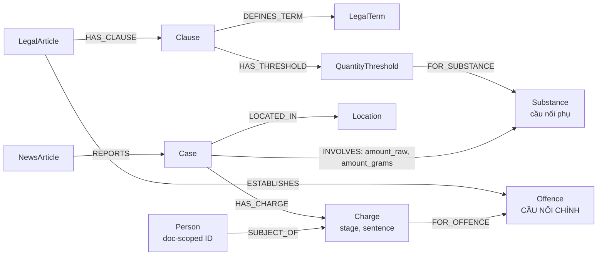

# Thiết kế Ontology — Day 19

**Họ tên:** Đinh Hoàng Đức
**MSSV:** 2A202602795

**Lựa chọn:**

- [ ] Dùng ontology gợi ý
- [x] Tự thiết kế (xét bonus +15)

## 0. Phạm vi và những gì xuất hiện trong hai KB

Đã đọc `data/drug_law/blhs-dieu-251.md`, bốn bài báo đại diện cho Q2–Q5
(`news-100260928173914514`, `news-100260918080821054`,
`news-100260920221957595`, `news-100260917203001265`) và sáu câu hỏi trong
`data/benchmark_kg.json`. Điều 251 có điều, khoản, tội danh, khung phạt, chất
ma túy và ngưỡng lượng. Tin tức có vụ việc, người/bí danh, cáo buộc, giai đoạn
tố tụng, mức án, địa điểm và vật chứng. Q1 còn cần thuật ngữ được định nghĩa;
Q5 cần đối chiếu lượng vật chứng với ngưỡng luật.

| Thứ/quan hệ quan sát được | Luật | Tin tức | Cả hai? | Ghi chú |
| --- | :---: | :---: | :---: | --- |
| Văn bản nguồn/tiêu đề | ✓ | ✓ | ✓ | Tách `LegalArticle` và `NewsArticle` vì khác ngữ nghĩa. |
| Điều, khoản, điểm | ✓ |  |  | `Clause` giữ khoản và hình phạt đúng nguyên văn. |
| Tội danh/hành vi | ✓ | ✓ | **✓** | Chuẩn hóa thành `Offence`, cầu nối chính. |
| Chất ma túy | ✓ | ✓ | **✓** | Chuẩn hóa thành `Substance`, cầu nối phụ. |
| Khối lượng/thể tích và ngưỡng | ✓ | ✓ | **✓** | Tin tức là vật chứng; luật là miền áp dụng. |
| Mức hình phạt | ✓ | ✓ | ✓ | Luật là khung, tin tức là kết quả/cáo buộc cụ thể. |
| Thuật ngữ và định nghĩa | ✓ |  |  | `LegalTerm` trả lời Q1. |
| Vụ việc, người, bí danh, vai trò |  | ✓ |  | Không lấy tên LLM tạo làm khóa toàn cục. |
| Giai đoạn tố tụng |  | ✓ |  | Lưu tại `Charge.stage`. |
| Địa điểm, thời điểm |  | ✓ |  | Thuộc `Case`. |
| Luật hóa tội danh | `LegalArticle` → `Offence` |  |  | `ESTABLISHES`. |
| Cáo buộc/kết quả |  | `Case`/`Person` → `Charge` → `Offence` |  | `Charge` giữ trạng thái và mức án. |
| Vật chứng | `Clause` → ngưỡng → `Substance` | `Case` → `Substance` | **✓** | Đối chiếu Q5 và gom Q6. |

## 1. Sơ đồ

`Offence` là **node cầu nối chính**: luật thiết lập tội danh, còn cáo buộc trong
tin tức trỏ đến cùng tội danh chuẩn. `Substance` là cầu nối phụ cho câu hỏi về
chất và khối lượng.



## 2. Entity types (node labels)

| Label | Ý nghĩa | Khóa định danh (`MERGE` theo) | Properties chính | KB | Trích bằng |
| --- | --- | --- | --- | --- | --- |
| `LegalArticle` | Một điều luật nguồn | `id = doc_id` | `number`, `title`, `law`, `doc_id` | luật | regex/front matter |
| `Clause` | Khoản của một điều | `id = article_id + ':khoan:' + number` | `number`, `text`, `penalty_text`, `penalty_min_years`, `penalty_max_years`, `penalty_rank`, `doc_id` | luật | regex |
| `LegalTerm` | Khái niệm được luật định nghĩa | `id = normalize(term)` | `name`, `definition`, `doc_id` | luật | regex định nghĩa |
| `Offence` | Tội danh chuẩn | `id = normalize_crime(tên chính thức)` | `name`, `aliases`, `source_doc_ids` | **cả hai** | luật: regex; tin: LLM + `link_entity` |
| `Substance` | Chất chuẩn, ví dụ MDMA | `id = normalize_identifier(canonical_name)` | `name`, `aliases`, `source_doc_ids` | **cả hai** | từ điển/regex; LLM map vào từ điển |
| `QuantityThreshold` | Miền lượng/thể tích của khoản luật | `id = clause_id + ':' + substance_id + ':' + lower + ':' + upper + ':' + unit` | `lower_value`, `upper_value`, `lower_grams`, `upper_grams`, `lower_inclusive`, `upper_inclusive`, `unit`, `doc_id` | luật | regex + đổi đơn vị |
| `NewsArticle` | Bài báo nguồn | `id = doc_id` | `title`, `publisher`, `published_at`, `doc_id` | tin | front matter |
| `Case` | Vụ việc trong một bài báo | `id = news_doc_id + ':case:' + ordinal` | `summary`, `event_date`, `source_title`, `doc_id` | tin | LLM, ordinal do pipeline gán |
| `Person` | Người được nêu trong vụ việc | `id = case_id + ':person:' + normalize(name)` | `name`, `aliases`, `role`, `doc_id` | tin | LLM; chưa kiểm tra tên là substring của nguồn bằng code |
| `Charge` | Cáo buộc/kết quả của một người trong một vụ | `id = case_id + ':charge:' + normalize(name_or_case) + ':' + offence_id` | `stage`, `stage_evidence`, `sentence_text`, `sentence_months`, `outcome`, `doc_id` | tin | LLM có schema; số tháng kiểm tra regex |
| `Location` | Địa danh của vụ | `id = normalize_identifier(name)` | `name`, `aliases`, `doc_id` | tin | LLM + chuẩn hóa nhẹ, chưa geocoding |

`doc_id` được đặt trên node sinh trực tiếp từ một tài liệu. `Offence` và
`Substance` là node chuẩn dùng chung nên lưu toàn bộ nguồn trong `source_doc_ids`;
`doc_id` của chúng là nguồn chuẩn đầu tiên (thường là luật). Cách này giữ truy
vết nguồn mà không gán một nguồn duy nhất sai cho thực thể dùng chung.

## 3. Relationships

`Clause.penalty_rank` là khóa sắp xếp số do parser suy ra (tử hình > chung thân > số năm tù); nó không thay thế `penalty_text` nguyên văn.

| Type | Từ → Đến | Properties trên cạnh | Ý nghĩa |
| --- | --- | --- | --- |
| `HAS_CLAUSE` | `LegalArticle` → `Clause` | — | Điều có khoản. |
| `ESTABLISHES` | `LegalArticle` → `Offence` | — | Điều luật quy định tội danh chuẩn. |
| `DEFINES_TERM` | `Clause` → `LegalTerm` | — | Khoản/điều đưa định nghĩa pháp lý. |
| `HAS_THRESHOLD` | `Clause` → `QuantityThreshold` | `point` | Khoản áp dụng ngưỡng ở điểm luật tương ứng. |
| `FOR_SUBSTANCE` | `QuantityThreshold` → `Substance` | — | Ngưỡng áp dụng cho chất/nhóm chất. |
| `REPORTS` | `NewsArticle` → `Case` | — | Bài báo tường thuật vụ việc. |
| `LOCATED_IN` | `Case` → `Location` | `source_text` | Địa điểm theo bài báo. |
| `INVOLVES` | `Case` → `Substance` | `amount_raw`, `amount_value`, `unit`, `amount_grams`, `evidence` | Vụ việc liên quan chất và lượng đã công bố. |
| `HAS_CHARGE` | `Case` → `Charge` | — | Vụ việc có cáo buộc/kết quả cụ thể. |
| `SUBJECT_OF` | `Person` → `Charge` | — | Người là chủ thể của cáo buộc/kết quả. |
| `FOR_OFFENCE` | `Charge` → `Offence` | `match_method`, `confidence` | Chuẩn hóa hành vi tin tức vào tội danh luật. |

## 4. Node cầu nối giữa 2 KB

- **Node nào:** `Offence` là cầu nối chính; `Substance` là cầu nối phụ.
- **Vì sao chọn:** Tin tức nêu ai bị bắt, truy tố hoặc tuyên án *về tội gì*; luật
  quy định tội đó, khoản, khung phạt và ngưỡng. Đây là đường trực tiếp cho Q3–Q5.
  `Case`/`Person` không có đối ứng trong KB luật.
- **Khớp tên:** dựng danh mục `Offence` từ tiêu đề luật trước. LLM tin tức phải
  chọn trong danh mục; `link_entity` dùng `normalize_crime` rồi mới so gần. Chất
  dùng từ điển chính tắc; alias “thuốc lắc”/“kẹo” map sang `MDMA` bằng heuristic
  sau bước LLM. Đây chưa phải xác nhận thành phần hóa học; nguồn mơ hồ có thể
  bị gộp sai. `amount_raw` luôn được giữ để kiểm toán.
- **Khi cầu gãy:** nếu bài chỉ viết “ma túy tổng hợp” hoặc hành vi mơ hồ, không
  suy đoán `FOR_OFFENCE`/`INVOLVES`; lưu câu gốc và trả lời thiếu dữ kiện. Nếu
  không khớp danh mục, không tạo cạnh cầu nối (chưa có node `unlinked`).
  `match_method='link_entity'`, `confidence=1.0` hiện là metadata cố định,
  không phải xác suất đã hiệu chuẩn. Context có thể mở rộng các cáo buộc cùng
  vụ, nên còn nguy cơ lấy cả điều luật của người khác.

## 5. Competency questions

`amount_grams` được đổi đơn vị trước khi so sánh (ví dụ 9,6 kg = 9600 g).

| Câu | Đường đi (Cypher pattern) | Trả lời được? |
| --- | --- | --- |
| Q1 | `MATCH (a:LegalArticle {id:'pcmt-dieu-2'})-[:HAS_CLAUSE]->(cl)-[:DEFINES_TERM]->(t:LegalTerm {id:'tiền chất'}) RETURN a.number, cl.number, t.definition` | Có — dùng `doc_id` ổn định thay vì chuỗi tên luật và trả định nghĩa kèm điều/khoản. |
| Q2 | `MATCH (:NewsArticle)-[:REPORTS]->(:Case)-[:HAS_CHARGE]->(ch:Charge {stage:'verdict'})<-[:SUBJECT_OF]-(p:Person) WHERE toLower(ch.sentence_text) CONTAINS 'tử hình' RETURN p.name, ch.sentence_text` | Có — chỉ lấy người đã bị tuyên án. |
| Q3 | `MATCH (p:Person {name:'Lê Minh Thành'})-[:SUBJECT_OF]->(ch)<-[:HAS_CHARGE]-(c:Case), (ch)-[:FOR_OFFENCE]->(o)<-[:ESTABLISHES]-(a:LegalArticle)-[:HAS_CLAUSE]->(cl:Clause {number:1}) RETURN ch.sentence_text,o.name,a.number,cl.penalty_text` | Có — từ án tin tức sang khoản cơ bản luật. |
| Q4 | `MATCH (p:Person) WHERE 'Hoàng Nato' IN p.aliases MATCH (p)-[:SUBJECT_OF]->(ch)<-[:HAS_CHARGE]-(:Case), (ch)-[:FOR_OFFENCE]->(o)<-[:ESTABLISHES]-(a)-[:HAS_CLAUSE]->(cl) WITH o,a,cl ORDER BY coalesce(cl.penalty_rank, coalesce(cl.penalty_max_years, 0)) DESC, cl.number DESC LIMIT 1 RETURN o.name,a.number,cl.number,cl.penalty_text` | Có — dùng alias và `penalty_rank` để “tù chung thân” xếp cao hơn 20 năm, rồi trả đúng khung cao nhất. |
| Q5 | `MATCH (p:Person {name:'Cái Quang Huy'})-[:SUBJECT_OF]->(ch)<-[:HAS_CHARGE]-(c:Case)-[i:INVOLVES]->(s:Substance {id:'mdma'}), (ch)-[:FOR_OFFENCE]->(o)<-[:ESTABLISHES]-(a:LegalArticle)-[:HAS_CLAUSE]->(cl)-[:HAS_THRESHOLD]->(t)-[:FOR_SUBSTANCE]->(s) WHERE i.amount_grams >= t.lower_grams AND (t.upper_grams IS NULL OR i.amount_grams < t.upper_grams) RETURN o.name,i.amount_raw,a.number,cl.number,cl.penalty_text` | Có — 9,6 kg MDMA khớp khoản 4 Điều 250. |
| Q6 | `MATCH (s:Substance {id:'mdma'})<-[i:INVOLVES]-(c:Case)<-[:REPORTS]-(n:NewsArticle) RETURN DISTINCT c.id,c.summary,n.title,i.amount_raw` | Có — gom mọi vụ MDMA. |

## 6. Quyết định thiết kế và đánh đổi

1. **ID `Case`/`Person` theo nguồn/vụ, không theo tên LLM.** Thay vì
   `MERGE` theo `name`, ID có tiền tố `doc_id`/`case_id` ngăn gộp nhầm tên trùng
   hoặc tên case LLM tự đặt. Đánh đổi: cùng vụ được nhiều báo đưa có thể tách;
   chỉ tạo `SAME_AS` khi có bằng chứng mạnh.
2. **`Charge` là node trung gian.** Cạnh `Person-[:INVOLVED_IN]->Case` khó chứa
   đồng thời tội danh, giai đoạn và kết quả. `Charge.stage` giúp Q2 lọc đúng
   `verdict`, tránh nhầm “bị bắt” với “bị kết án”. Đánh đổi: thêm một hop/node.
3. **`QuantityThreshold` số hóa ngưỡng.** Chỉ lưu `Clause.text`/`penalty` không
   thể đối chiếu 9,6 kg MDMA với khoản nào một cách tất định. Node ngưỡng nối
   `Substance` cho phép Q5 so sánh số. Đánh đổi: regex phải thận trọng với điều
   kiện kết hợp và dữ liệu thiếu đơn vị.
4. **`Substance` chính tắc có alias, vẫn giữ bằng chứng gốc.** Khóa LLM tự sinh
   làm vỡ Q6 giữa MDMA/“thuốc lắc”/“kẹo”. Từ điển gộp alias trực tiếp;
   `amount_raw` và `evidence` vẫn lưu chuỗi lượng nguồn. Đánh đổi: alias mơ hồ
   có thể bị ánh xạ sai; cần lưu xác nhận giám định và tách tên gọi thương mại.

## 7. So với ontology gợi ý (bắt buộc nếu xét bonus)

Thiết kế đã được dựng bằng Groq thật; graph đầy đủ có 469 node / 715 cạnh,
đủ 11 labels và 11 relationship types (audit trong `KG_INSPECTION.json`).
Đã chạy hai benchmark thật, không sửa file đầu ra:

```bash
python bench_kg.py --judge
LAB_SOLUTION_PACKAGE=src_hint python bench_kg.py --judge --out ket_qua_benchmark_kg.hint.txt
```

Adapter `src_hint` gọi các writer HINT có sẵn, dùng Crime làm cầu nối,
giữ khóa theo tên và chọn khoản 1 hoặc khoản MENTIONS chất liên quan.
Chỉ bổ sung `doc_id` còn thiếu để tuân thủ hợp đồng lab. Graph HINT có
185 node / 349 cạnh, 7 labels; dữ liệu kiểm toán trước khi khôi phục graph
custom lưu ở [KG_INSPECTION.hint.json](KG_INSPECTION.hint.json).

| Chỉ số GraphRAG | HINT | Thiết kế này | Thay đổi |
| --- | ---: | ---: | --- |
| Recall trung bình | 0,37 | 0,71 | +0,34 điểm |
| Judge trung bình (0–2) | 0,83 | 1,67 | +0,84 điểm theo số làm tròn |
| Indexing USD | 0,00418 | 0,00421 | +0,00003 |
| Query USD/câu | 0,00029 | 0,00024 | 0,83 lần HINT |
| Query giây/câu | 16,57 | 16,06 | 0,97 lần HINT |

Không phải chỉ đổi tên: có node định nghĩa, ngưỡng số, cáo buộc theo người và
giai đoạn. Bằng chứng giải quyết vấn đề cụ thể:

| Điểm khác | Gợi ý làm gì | Thiết kế này làm gì | Vấn đề giải quyết | Bằng chứng đã chạy |
| --- | --- | --- | --- | --- |
| Định nghĩa pháp lý | Không có node khái niệm định nghĩa | 14 `LegalTerm` gắn Clause | Q1 không còn phụ thuộc top-k có đúng đoạn định nghĩa | Q1 HINT “Không đủ thông tin.”, judge 0; custom có định nghĩa tiền chất, judge 2. |
| Khung cao nhất | Khoản 1 hoặc khoản có chất; không xếp hạng khung | `penalty_rank` + rule “tối đa” | Q4 không nhầm khung cơ bản là mức tối đa toàn điều | Context HINT Q4 chỉ có Điều 255 khoản 1; custom lấy khoản 4, judge 0 → 2. |
| Ngưỡng khối lượng | Khoản có text/penalty, chưa có cận số | 221 `QuantityThreshold`, nối chất chuẩn | Q5 chọn khoản theo lượng vật chứng | Audit `mdma_threshold_match`: Cái Quang Huy, 9600g, cận dưới 100g, Điều 250 khoản 4, “phạt tù 20 năm, tù chung thân hoặc tử hình”. |
| Giai đoạn tố tụng | `sentence` nằm trên `INVOLVED_IN` | `Charge.stage` theo người/tội | Có thể lọc verdict, không đồng nhất bắt giữ với kết án | Audit `verdict_people` trả Trần Thanh Tuấn và Trần Minh Tâm, `stage='verdict'`; Q2 hai ontology cùng judge 2, không nhận là cải thiện điểm. |
| Chất đồng nghĩa | `Substance.name` là chuỗi LLM (15 node) | Khóa chính tắc + alias (10 node), giữ chứng cứ | Có thể gom MDMA/thuốc lắc để truy vấn | Audit `mdma_cases` trả 5 Case; Q6 cả hai vẫn judge 0 nên chưa chứng minh trả lời đầy đủ tốt hơn. Alias heuristic có nguy cơ sai. |
| Định danh người/vụ | `MERGE` theo tên LLM | ID có tiền tố `case_id`/`doc_id` | Giữ nguồn, tránh phụ thuộc tên vụ tùy ý | Tính idempotent đã kiểm thử bằng JSON cố định; E3 vẫn có 2 Person Dương Minh Tuấn. **Không nhận là bằng chứng giảm trùng liên-bài.** |

Competency questions cải thiện trong lượt thực tế:

| Câu | HINT recall / judge | Custom recall / judge | Nội dung khác biệt |
| --- | --- | --- | --- |
| Q1 | 0,00 / 0 | 1,00 / 2 | Định nghĩa tiền chất từ LegalTerm. |
| Q2 | 1,00 / 2 | 1,00 / 2 | Cùng đúng hai bị cáo tử hình. |
| Q3 | 0,33 / 2 | 0,00 / 2 | Cùng đúng ngữ nghĩa; recall bị format làm lệch, không coi là custom thắng. |
| Q4 | 0,67 / 0 | 1,00 / 2 | HINT nói tối đa 7 năm; custom nêu 20 năm hoặc chung thân theo khoản 4. |
| Q5 | 0,20 / 1 | 0,60 / 2 | HINT bịa Điều 249 và lặp, custom đúng Điều 250 khoản 4/ngưỡng MDMA. |
| Q6 | 0,00 / 0 | 0,67 / 0 | Cả hai không liệt kê đủ; custom recall tăng không đồng nghĩa chất lượng đúng. |

Hai lượt cùng model, prompt trích tin, linker, corpus, chunk, top-k và ngân sách
graph; trích xuất/chấm điểm LLM độc lập. Flat judge cũng dao động 0,33 → 0,50.
Chỉ sáu câu, một lượt mỗi ontology, có retry/rate limit nên không kết luận
nhân quả hay ý nghĩa thống kê. Lợi ích quan sát gồm **schema và retrieval
phù hợp schema**, không tách riêng tác động từng thay đổi. Bằng chứng bonus
là file benchmark thật, Q1/Q4/Q5 và phép so ngưỡng tất định; không phải mọi
điểm yếu ontology gợi ý đều đã được giải quyết.

## 8. Hạn chế còn lại

- Không tự nhận diện cùng một vụ giữa nhiều bài báo; ưu tiên không gộp sai.
- Alias chất có thể mơ hồ; heuristic hiện vẫn map alias đã biết vào chất chuẩn.
- Khoản có điều kiện kết hợp, tổng lượng tương đương hoặc ml cần parser và test
  riêng; chỉ so sánh khi ngưỡng có cận/đơn vị đáng tin cậy.
- `stage` chỉ phản ánh bài báo tại thời điểm xuất bản, không thay thế hồ sơ tố
  tụng chính thức.

## 9. Kiểm chứng KG-1/KG-2

KG-1: `pytest tests/test_graph.py -k LinkEntity -v` đạt **5 passed**.
Các test bổ sung trong `tests/test_graph_build.py` đạt **8 passed**: JSON sai dạng
phải báo `doc_id`, tội danh không liên quan không bị gán cho người, giai đoạn
thuộc từng người, 8 năm 6 tháng = 102 tháng, chung thân/tử hình được xếp đúng,
MDMA khoản 4 Điều 250 có cận dưới 100 g, và chỉ điều giải thích từ ngữ sinh
14 `LegalTerm`.

Đã chạy `python scripts/verify_kg2_fixture.py` với **Neo4j thật**, toàn bộ
18 điều luật và 2 tin (`news-100260918080821054`, `news-100260928173914514`).
Script thay graph hiện tại bằng graph kiểm thử và dùng JSON cố định từ nội dung
bài báo thay cho LLM: **388 node / 586 cạnh, 0 lần gọi API**. Đây là bằng chứng
cho phần ghi graph, không phải kết quả đánh giá trích xuất bằng LLM hay benchmark.

| Label | Số node |
| --- | ---: |
| `LegalArticle` | 18 |
| `Clause` | 99 |
| `LegalTerm` | 14 |
| `Offence` | 13 |
| `Substance` | 9 |
| `QuantityThreshold` | 221 |
| `NewsArticle` | 2 |
| `Case` | 2 |
| `Person` | 3 |
| `Charge` | 5 |
| `Location` | 2 |

Các assertion trên Neo4j đã đạt: mọi node có `doc_id` thuộc tài liệu đã nạp;
truy vấn cầu nối trong đề trả được 5 đường đi (3–4 cạnh); Lê Minh Thành nối
qua `Charge` → `Offence` đến đúng Điều 251 và có 36 tháng tù; node MDMA giữ
nguồn luật và tin; dựng lại cùng JSON không tăng số node/cạnh.

Ban đầu thiếu API key (`SETUP-1`); sau khi cấu hình Groq GPT-OSS 20B đã chạy
`--check` thật đạt đủ 7 `[OK]`, gồm graph 386 node / 585 cạnh và context có
Điều 251. Full suite hiện đạt **74 passed, 4 subtests passed**; không sửa
`bench_kg.py` hay 48 test gốc. Kết quả kiểm tra cuối nằm trong `REPORT_KG.md`.

## 10. KG-3/KG-4: chính sách lấy ngữ cảnh và kiểm chứng

`context()` dùng seed từ câu hỏi và `doc_id` của chunk, mở rộng tới vụ, người,
cáo buộc rồi qua `Offence` đến luật. Khoản được lấy gồm khoản 1, khoản có ngưỡng
khối lượng khớp vật chứng, và khoản có `penalty_rank` cao nhất khi hỏi “tối đa”.
Q1 lấy định nghĩa từ `LegalTerm`; Q6 mở rộng mọi vụ có chất chuẩn được hỏi,
không chỉ những vụ lọt top-k vector. Dữ kiện luật/định nghĩa được ưu tiên trước
cạnh seed khi cắt ở `max_facts=60`. `GraphRAGAgent` thêm ngân sách 4.800 ký tự
cho graph, chỉ lấy nguyên fact; nếu bỏ fact thì cảnh báo danh sách không đầy đủ.
Khoản dài trên 900 ký tự được rút về hình phạt nguyên văn và điểm chứa chất
được hỏi. Đây là giới hạn ký tự, không phải bộ đếm token chính xác.

Đánh đổi: ít khoản hơn so với lấy toàn bộ luật, nhưng chưa bao phủ điều kiện
tăng nặng không dựa trên khối lượng, tổng lượng tương đương hay vật chứng chỉ
đếm bằng viên. Giới hạn prompt cũng có thể bỏ thông tin người hoặc vụ ở cuối
danh sách, nhất là Q6. Phần Per question và số liệu token/recall/judge thực tế
được phân tích trong `REPORT_KG.md`.

`GraphRAGAgent.answer()` tìm top-k giống Flat RAG, khử trùng `doc_id`, gọi
`graph.context`, điền cả graph facts và chunk vào `GRAPH_PROMPT`, rồi gọi LLM.

Đã thử Cypher trong Neo4j Browser trước khi đưa vào Python: vụ Lê Minh Thành
đi qua `Charge` → `Offence` → `LegalArticle` → `Clause`, trả Điều 251, khoản 1,
“phạt tù từ 02 năm đến 07 năm”. `python scripts/inspect_kg.py` kiểm chứng lại
KG-3/KG-4 trên graph thật hiện tại, với LLM trả nguyên prompt để kiểm tra nội
dung; kết quả được lưu tại `report/KG_INSPECTION.json`. Đây không phải câu trả
lời LLM hay benchmark. Xem `report/REPORT_KG.md` để biết các lỗi thực sự
quan sát được khi chạy benchmark và kiểm toán graph.
